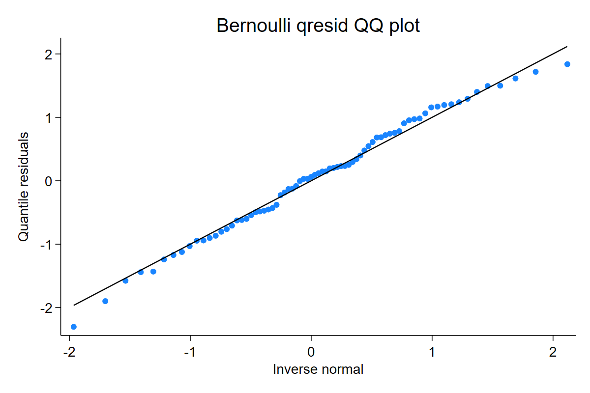
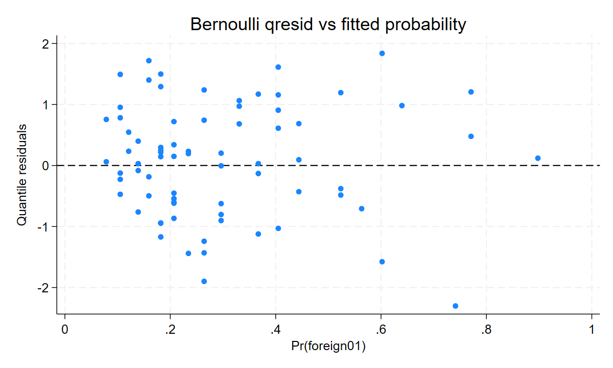

Binary and grouped-binomial data are discrete, so benchmarks use shared uniforms through `uvar()`. In everyday use, set a seed when you want repeatable plots.

## Bernoulli logit

```stata
sysuse auto, clear
generate byte foreign01 = foreign
logit foreign01 mpg
qresid qr_logit, seed(20260510) family(bernoulli)
qnorm qr_logit
predict fitted_foreign, pr
scatter qr_logit fitted_foreign, yline(0)
```

[Full Stata output](assets/output/binomial_logit.txt)





Interpretation: for Bernoulli data, the residual plot can look noisy because each observation is only 0 or 1. Look for systematic curvature, separation-like extremes, or fitted-probability regions with repeated tail departures.

## Grouped binomial

Grouped binomial residuals are row-level residuals for counts out of trials, not residuals for each expanded individual. Keep the trials denominator explicit:

```stata
glm successes x, family(binomial trials) link(logit)
qresid rq_grouped, seed(20260510)

binreg successes x, n(trials) or
qresid rq_binreg, seed(20260510)
```

Do not treat trials as generic weights. Grouped-binomial weights are a separate gate.
