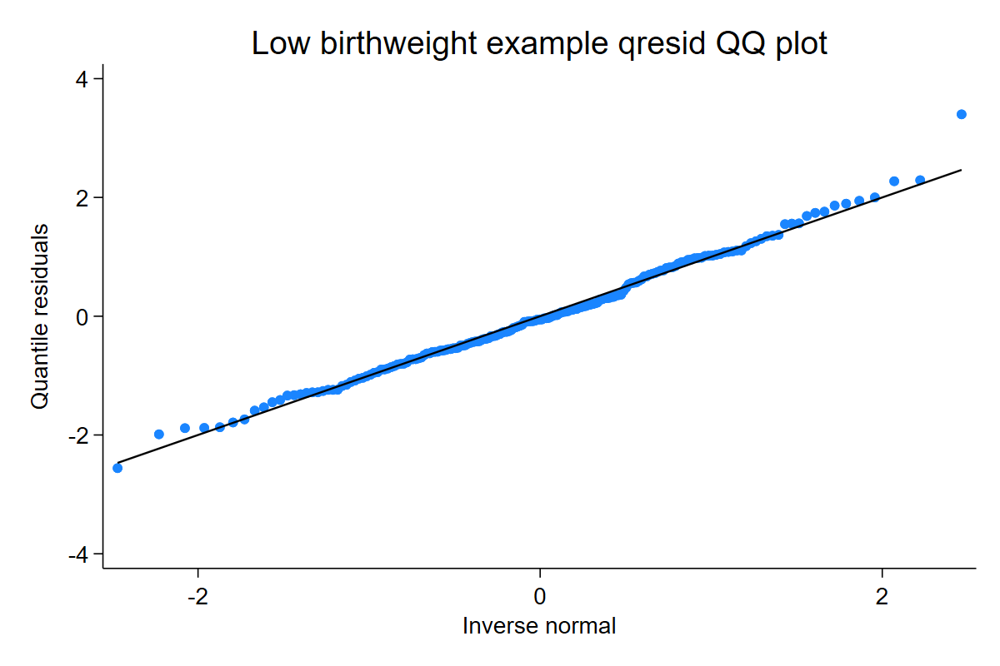
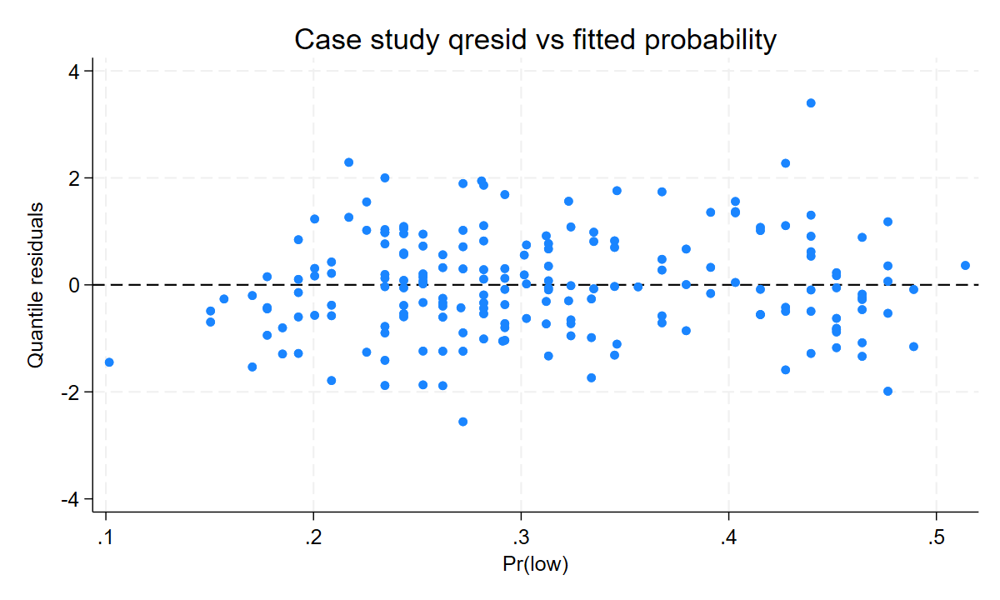

Applied cases should compare a plausible simple model with a better model, then use the same residual language to explain what improved.

## Low birthweight example

This page uses Stata's `lbw` dataset when available. If it cannot be downloaded, the generator falls back to a small simulated health-like binary example so the page remains reproducible.

```stata
webuse lbw, clear
logit low smoke age
qresid qr_lbw, seed(20260510) family(bernoulli)
qnorm qr_lbw
predict fitted_lbw, pr
scatter qr_lbw fitted_lbw, yline(0)
```

[Full Stata output](assets/output/case_lbw.txt)





Interpretation: this is a teaching example, not a causal claim. The residuals help ask whether the fitted Bernoulli distribution leaves systematic tail or fitted-probability patterns.

## Casebank roadmap

| case | source | teaching use |
|---|---|---|
| `NMES1988` | `AER` | medical visits; Poisson vs NB vs zero-inflated or hurdle-style count models |
| `esoph` | R `datasets` | grouped binomial cancer case-control strata |
| `Contraception` | `mlmRev` | future bridge to correlated binary models; use marginal/non-correlated models only in current examples |
| `bioChemists` | `pscl` | publication count example with overdispersion and zero patterns |

Each case should show one intentionally imperfect model and one improved model, then compare QQ-normal and residual-versus-fitted patterns.
