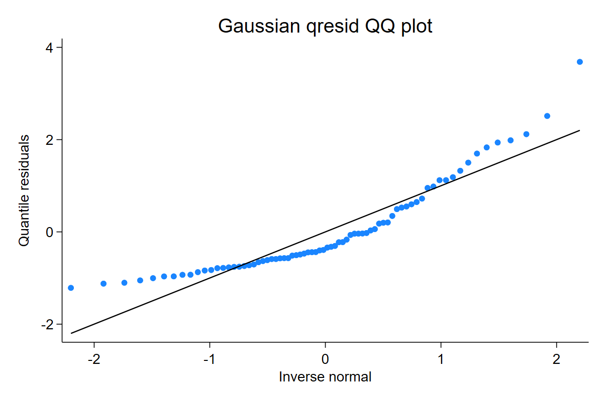
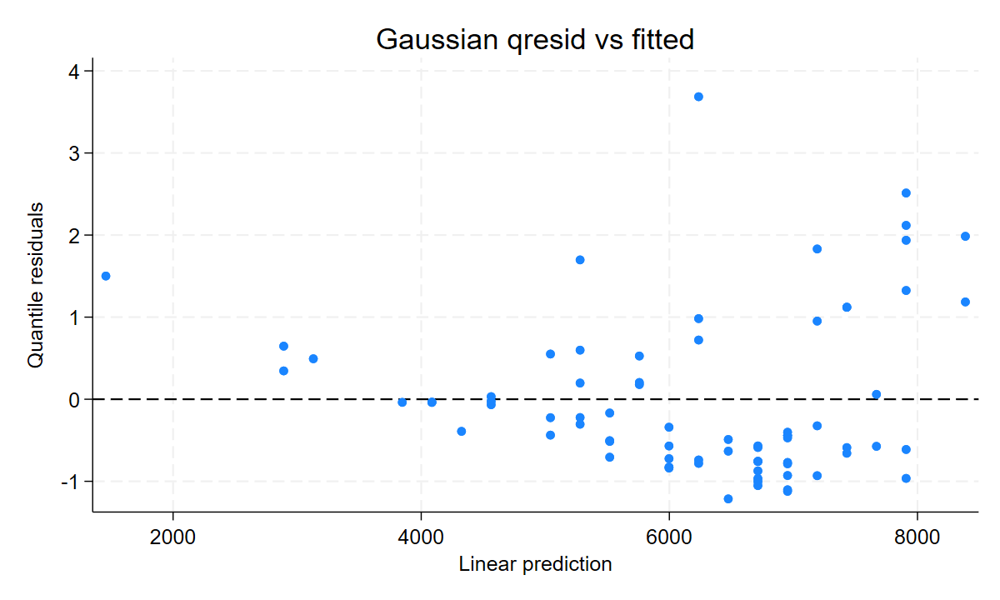

Continuous examples teach the basic diagnostic rhythm: fit a model, create quantile residuals, inspect the QQ-normal plot, then check residuals against fitted values.

## Gaussian regression

```stata
sysuse auto, clear
regress price mpg
qresid qr_gaussian
qnorm qr_gaussian
predict fitted_price, xb
scatter qr_gaussian fitted_price, yline(0)
```

Output excerpt:

```text
regress price mpg
qresid qr_gaussian
summarize qr_gaussian
```

[Full Stata output](assets/output/continuous_gaussian.txt)





Interpretation: the QQ-normal plot asks whether the fitted normal model leaves residuals that look like standard normal noise. The residual-versus-fitted plot is where mean-variance patterns, outliers, or omitted nonlinear terms become easier to see.

## Positive continuous models

For Gamma and inverse Gaussian models, the same workflow applies, but the fitted CDF respects positive support:

```stata
glm y x, family(gamma) link(log)
qresid rq_gamma, family(gamma)
qnorm rq_gamma

glm y x, family(igaussian) link(log)
qresid rq_ig, family(igaussian)
qnorm rq_ig
```

Use these routes when the response is strictly positive and skewed. Compare Gamma and inverse Gaussian only when both are scientifically plausible; the residual plot helps show whether tail behavior is improving.
