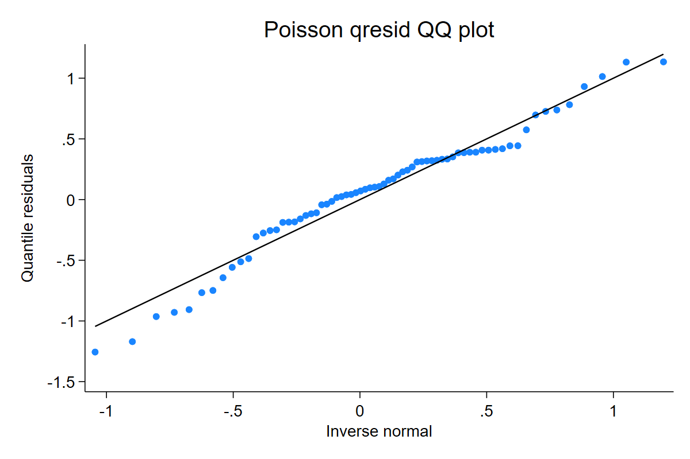
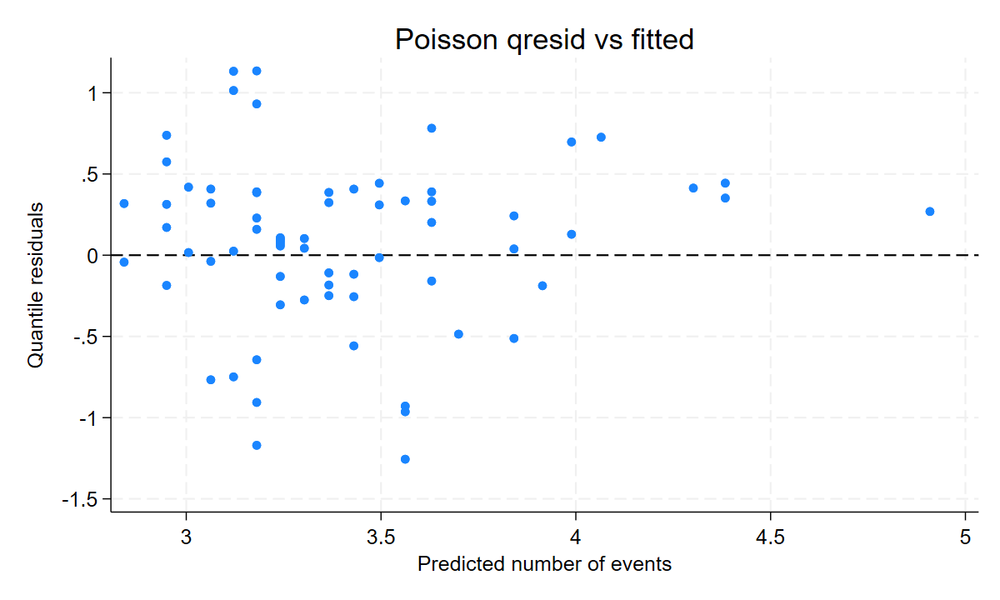

Count outcomes are where quantile residuals are especially useful. Ordinary residuals often form bands because the outcome is discrete; `qresid` randomizes inside each fitted CDF jump and maps the result to the normal scale.

## Poisson starting point

```stata
sysuse auto, clear
poisson rep78 mpg if rep78 < .
qresid qr_poisson, seed(20260510)
qnorm qr_poisson
predict fitted_rep78, n
scatter qr_poisson fitted_rep78, yline(0)
```

[Full Stata output](assets/output/count_poisson.txt)





Interpretation: curvature or tail departures in the QQ-normal plot suggest the Poisson variance or support may be inadequate. A patterned residual-versus-fitted plot suggests trying NB, zero-inflated, truncated/censored, generalized Poisson, or pinned hurdle routes when the data-generating story supports them.

## Extension count routes

`qresid` has local extension-prerelease evidence for NB variants, ZIP/ZINB, truncated count, censored count, generalized Poisson, and pinned hurdle estimators. These pages teach use, but the support matrix remains the authority for which route is ready.

```stata
nbreg y x, dispersion(mean)
qresid rq_nb, seed(20260510)

zip y x, inflate(z)
qresid rq_zip, seed(20260510)

tpoisson y x, ll(0)
qresid rq_tpois, seed(20260510)
```

Use a simpler model first, then compare residual plots after moving to the model that matches the support: overdispersion, structural zeros, truncation, censoring, or a hurdle process.
