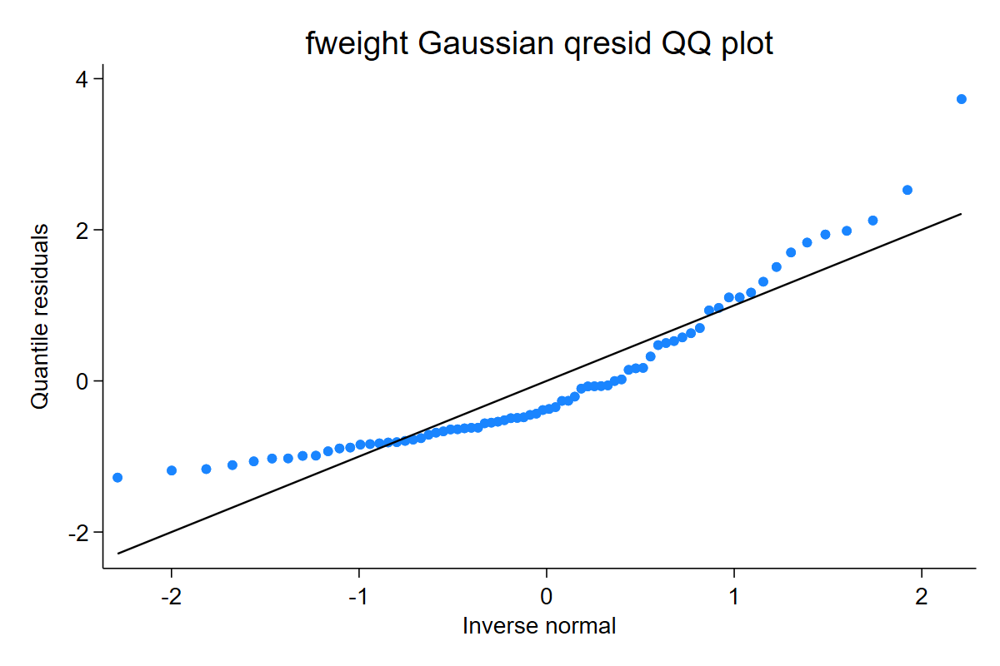

`qresid` does not apply a universal final multiplier such as `sqrt(w_i)`. A weight changes the fitted model and therefore the fitted CDF. Each supported weighted route has its own validation evidence.

## Frequency weights

```stata
sysuse auto, clear
generate int fw = 1 + mod(_n, 3)
regress price mpg [fweight=fw]
qresid qr_fweight
qnorm qr_fweight
```

[Full Stata output](assets/output/weights_fweight.txt)



Interpretation: frequency weights are interpreted as collapsed repeated rows in the validated routes. The residual is still a fitted-CDF residual; it is not multiplied by a final weight factor.

## Direct pweights

Direct `[pweight=]` support is diagnostic and model-based. It is not `svy:` support and should not be described as exact survey-design residual inference.

```stata
regress price mpg [pweight=pw]
qresid qr_pweight
```

The support matrix marks this route as diagnostic because the model fit uses pweights, but there is no simple individual-CDF R benchmark equivalent to base `glm(weights=)` survey semantics.
